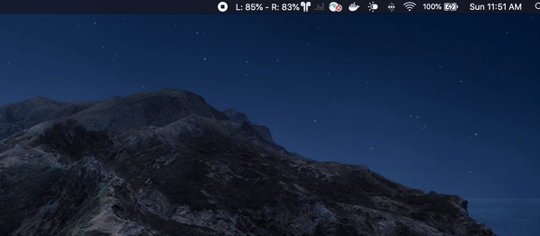
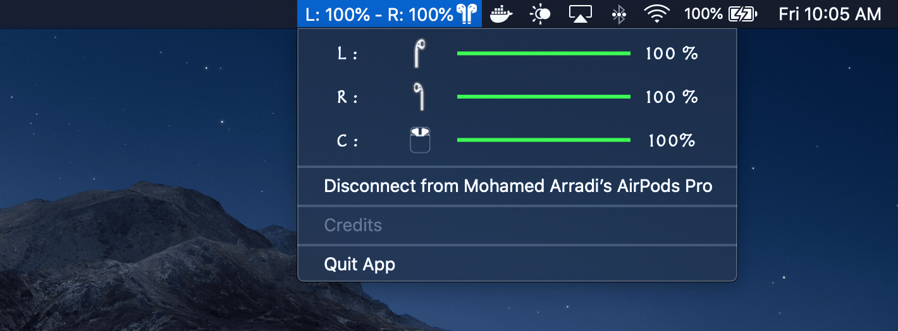
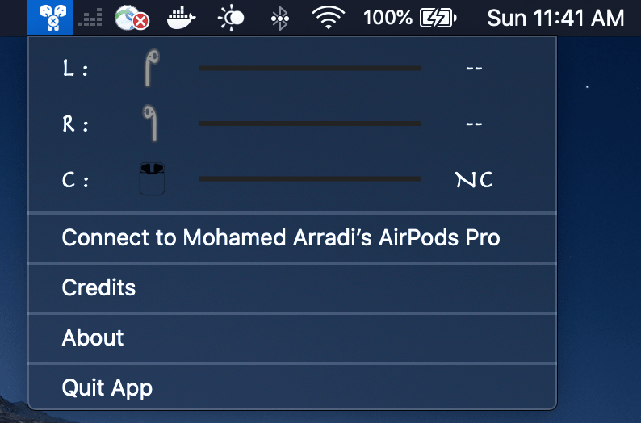

# AirPods Battery Monitor For MAC OS X

Airpods Mac OS App which show you the battery percentage of your airpods and Airpods Pro.

A small Mac OS App that allow you to see easily your AirPods Battery (Case/ Left / Right) in real-time ! 

It is a shortcut to remove the long and painfull access from the Bluetooth Tab that Mac OS X provide.

**Current Release Version: 1.0

## HOW TO INSTALL IT ?

**Direct Download Link**

Just download the latest version here: https://github.com/mohamed-arradi/AirpodsBattery-Monitor-For-Mac/raw/master/releases/1.0.0/Airpods%20Battery%20Monitor-1.0.0.zip

**Via Homebrew**

Work in progress

## Why this App can be useful to you ?

On Mac OS, in order to get the battery information from your AirPods you need to Select your bluetooth device and then navigate to the Battery Mode. Now this time is over ! Just an Eye look to the Top and done !

This is why I build this tiny mac status bar app.

### DEMO 

### REMAINING TO DO

- Add Notifications for Battery under 10%, etc 
- Add TouchBar App in order to see the battery from the touch bar
- Make it Generic in order to detect battery from Sony WF 1000xm3, etc..
- Support multiple languages

### HISTORY

**1.0.0**

 * V1 AirPods Battery Monitor
 * Connect / Disconnect from your Airpods
 * Detect Battery from Case / Left Ear / Right Ear

### SCREENSHOTS

**AirPods Connected**

**AirPods Disconnected**

### Why it is not on the App Store ?

This is a MacOSX App build with xCode using Swift 5.0 and Sandbox Not activated in order to beneficiate from the bash permission.

This App cannot be allowed right now on the Mac App Store due to the necessary temporary exceptions required. (Except if you manage to bribe some Apple Reviewers which I did not succeeded yet :))

### CONTRIBUTING

If you want to contribute to improve it, it will be with pleasure !

### Image Credits

- Airpod Case by Joel Wisneski from the Noun Project

- AirPods case by Mathijs Boogaert from the Noun Project

- https://icon-icons.com/fr/icone/airpods/110461#32

- https://icon-icons.com/fr/icone/airpods-pas-connect%C3%A9/110456#32

### LICENCE

This project is licensed under the MIT License - see the [LICENSE.md](LICENSE.md) file for details

### SUPPORT

You like it ? help supporting this app by giving me **Coffee** to not sleep for coding :)

