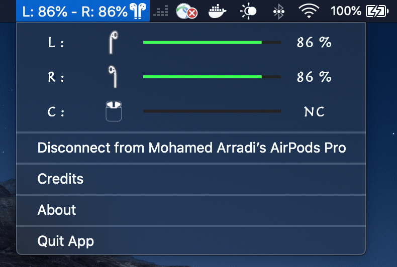

# AirPods Battery Monitor For MAC OS X

Airpods Mac OS App which show you the battery percentage of your airpods and give you notifications when airpods battery is low!

A small Mac OS App that allow you to see easily your AirPods Battery in real-time ! It is a shortcut to the long and painfull access from the Bluetooth tab

**Current Release Version: 1.0

## How to download directly the App ?

Just download the App zip file here : https://github.com/mohamed-arradi/DarkModeSwitcher/tree/master/Release

## Why this App can be useful to you ?

On Mac OS,  in order to get the battery information from your AirPods you need to Select your bluetooth device and then navigate to the Battery Mode. Now this time is over ! Just an Eye look to the Top and done !

This is why I build this tiny mac status bar app.

## Getting Started

This is a MacOSX App build with xCode using Swift 5.0 and Sandbox Not activated in order to beneficiate from the bash permission.

This App cannot be allowed right now on the Mac App Store due to the necessary temporary exceptions required. (Except if you manage to bribe some Apple Reviewers which I did not succeeded yet :))

### DEMO 

### Language handled

- **English ONLY for now. (Don't hesite to contribute to translate if you feel the need)

### Screenshots

*AirPods Connected*

*AirPods Disconnected*

### Contributing

If you want to contribute to improve it, it will be with pleasure !

### REMAINING TO DO

- Add Notifications for Battery under 10%, etc 
- Add TouchBar App in order to see the battery from the touch bar
- Make it Generic in order to detect battery from Sony WF 1000xm3, etc..

### HISTORY

**1.0

 ** Improving UI
 ** Added Missing Permissions for Mac OS Mojave
 ** Implemented keyboard shortcut 

**1.0.0

 * V1 AirPods Battery Monitor
 * Connect / Disconnect from your Airpods
 * Detect Battery from Case / Left Ear / Right Ear

### Image Credits

Icons:

- Airpod Case by Joel Wisneski from the Noun Project

- AirPods case by Mathijs Boogaert from the Noun Project

- https://icon-icons.com/fr/icone/airpods/110461#32

- https://icon-icons.com/fr/icone/airpods-pas-connect%C3%A9/110456#32

### License

This project is licensed under the MIT License - see the [LICENSE.md](LICENSE.md) file for details

### Support

You like it ? help supporting this app by giving me Coffee to not sleep for coding :)

